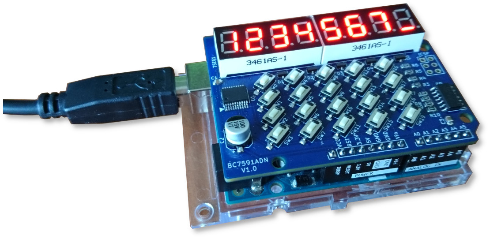

# BC759x LED Dispaly Driver Library For Arduino

This library is for the BC759x LED display driver chips. It uses UART (hardware serial or software serial) to communicate.

An Arduino shield made with BC7591 chip

## About BC759x chips

BC7595 and BC7591 chips can provide both LED display (7-segment display) drivers and keyboard interfaces. It uses UART for communication. BC7595 can drive up to 48 segments LEDs and can support up to 48 keys. BC7591 can drive up to 256 segments LEDs and supports up to 96-key keyboard. Both BC7595 and BC7591 are in SSOP 20 package.

## About this library

This library wraps up all the low level serial port operations and provides several upper layer functions for using the 7-segment displays, such as display values in decimal and in hexadecimal, digital blink etc.

## Compatibility

This library works with any Arduino architechture which has serial port ability, either hardware serial or software serial.
